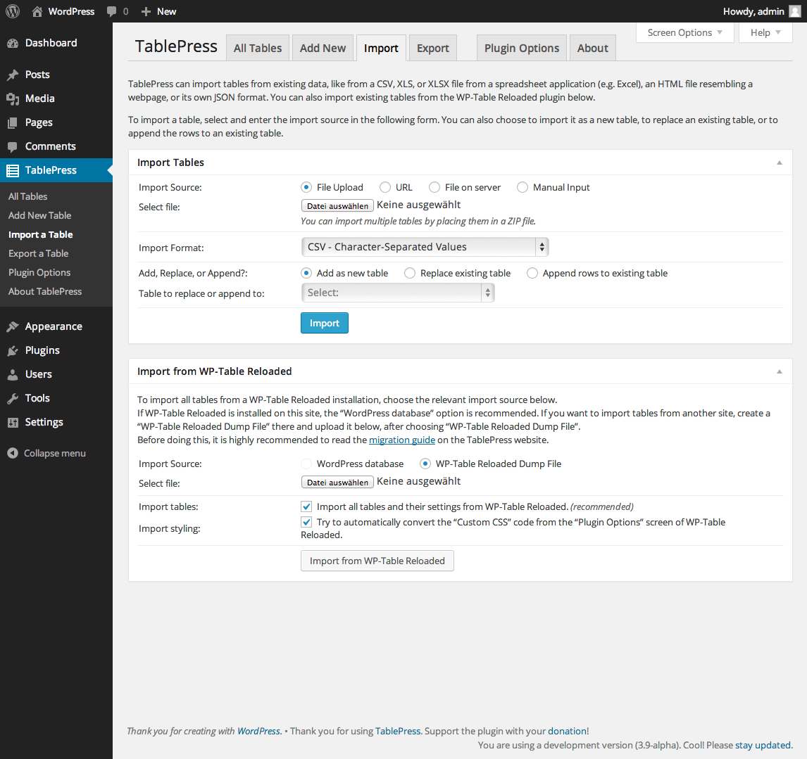

=============================================
TablePress - Plugin
=============================================

**Download:** https://wordpress.org/plugins/tablepress/

Last version: https://downloads.wordpress.org/plugin/tablepress.1.6.zip

**Installation:**

The easiest way to install TablePress is via your WordPress Dashboard. 

Go to the "Plugins" screen, click "Add New", and search for "TablePress" in the WordPress Plugin Directory.

Then, click "Install Now" and the following steps will be done for you automatically. 

After the installation, you'll just have to activate the TablePress plugin.

More info: https://wordpress.org/plugins/tablepress/installation/

**Usage**

Edit my.cnf and add

::

	max_allowed_packet = 100M

Create a new table with import 

Download file in "Download Section"

Then the import of the table add "Custom Commands": 

::

	"order": [[ 0, "asc" ]]

Add table in a page 

The Shortcode [table id=N /] is used to display a table in a post, on a page,

example 
[table id=1 column_widths="20%|60%|20%"/]

